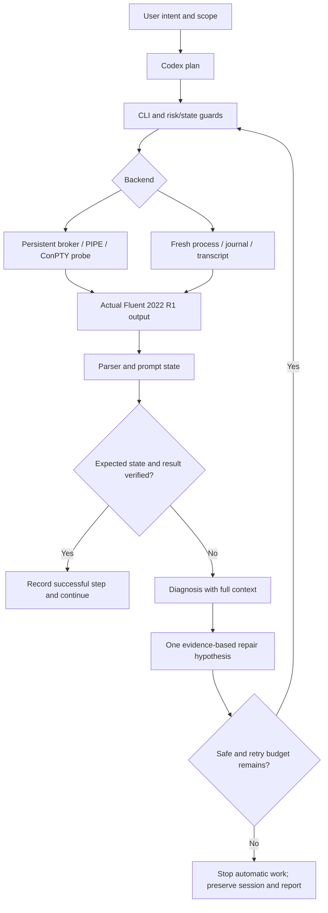

# Architecture and design

Author: Manuel Sun

## Execution and observation

## Modules

| Module | Responsibility |
|---|---|
| `fluent_driver.py` | Unified CLI, persistent localhost broker, serialized mutation requests. |
| `fluent_discovery.py` | Candidate discovery, v221 verification, clear selection evidence. |
| `fluent_process.py` | Launch options, transport probe, incremental reads, process lifecycle. |
| `windows_conpty.py` | Optional native pseudoconsole transport without a third-party Python package. |
| `fluent_parser.py` | Parse the complete output window and identify the latest fresh prompt. |
| `fluent_error_analyzer.py` | Structured classification, confidence, evidence, cause, proposed action. |
| `fluent_session.py` | State/risk guards, step progress, bounded repair, checkpoint and rollback. |
| `journal_runner.py` | Non-overwriting run directories, wrapper journals, transcript, result evidence. |
| `fluent_common.py` | Configuration, shared structures, timestamps and local audit logging. |

The local broker exists because independent `start`, `send`, and `status` CLI invocations cannot themselves share stdin handles. It binds to loopback, uses a random session token, and keeps Solver ownership explicit. Session metadata is private local state and must never be committed.

## TUI state and success

States are ROOT, MENU, COMMAND_ARGUMENT, YES_NO_PROMPT, ZONE_PROMPT, VALUE_PROMPT, SCHEME, SOLVING, ERROR, and UNKNOWN. A pending zone/value prompt blocks an unrelated full TUI command. Prompt responses require a regex matching the observed prompt. Empty Enter, comma, a literal empty string, `()`, and yes/no are different inputs.

A successful input can still end at a sub-prompt. A completed command can still produce an undesired physical result. Plans should verify both command completion and a relevant field/settings report. The tested closed-wall cube accepted pressure patch input but returned 0 Pa, so it did not satisfy a 486540 Pa postcondition. A separate open fixture tested that postcondition without modifying a user's physical model.

## Diagnosis and correction

An error record retains the command, previous prompt, complete local output context, error lines, Error Object, and subsequent prompt. A correction records original input, diagnosis, hypothesis, modified input, reason, and observed outcome.

The built-in typo repair is supported by a newly read parent menu, a unique close terminal match, and a verified return to root. Other repairs must be explicit evidence-matched plan candidates. Repeating the same failed command, changing unrelated tokens, or resetting the retry count by resuming the same plan is blocked. Default budget: initial attempt plus at most three automatic retries.

READ_ONLY operations can recover automatically. LOW_RISK operations are normally permitted within the task. STATE_CHANGING operations must belong to the original goal. DESTRUCTIVE operations are never automatic trial-and-error repairs. Checkpoints use unique files; rollback is a deliberate replacement of state, not the default response to an error.

## Backend limits

Interactive availability requires actual runtime version evidence, root prompt, query result and another prompt. ConPTY is attempted only as an alternative transport and is unavailable until the same probe passes. It failed to produce a Fluent prompt on the tested workstation.

Journal mode uses a new process and cannot inherit an unrelated interactive session's unsaved state. Transactions need explicit inputs/checkpoints. A standalone emitted marker, accepted output, and successful process completion are required; an echoed marker or exit code alone is insufficient. Original journals containing early `exit` may prevent wrapper completion and need review. See [API and plans](../references/api_and_plans.md).

Arbitrary command semantics, solver convergence, physical validity, and every v221 model-specific prompt cannot be proven by a finite parser. Unknown states stop automatic execution. Version-specific runtime output has priority over remembered commands and newer documentation.
